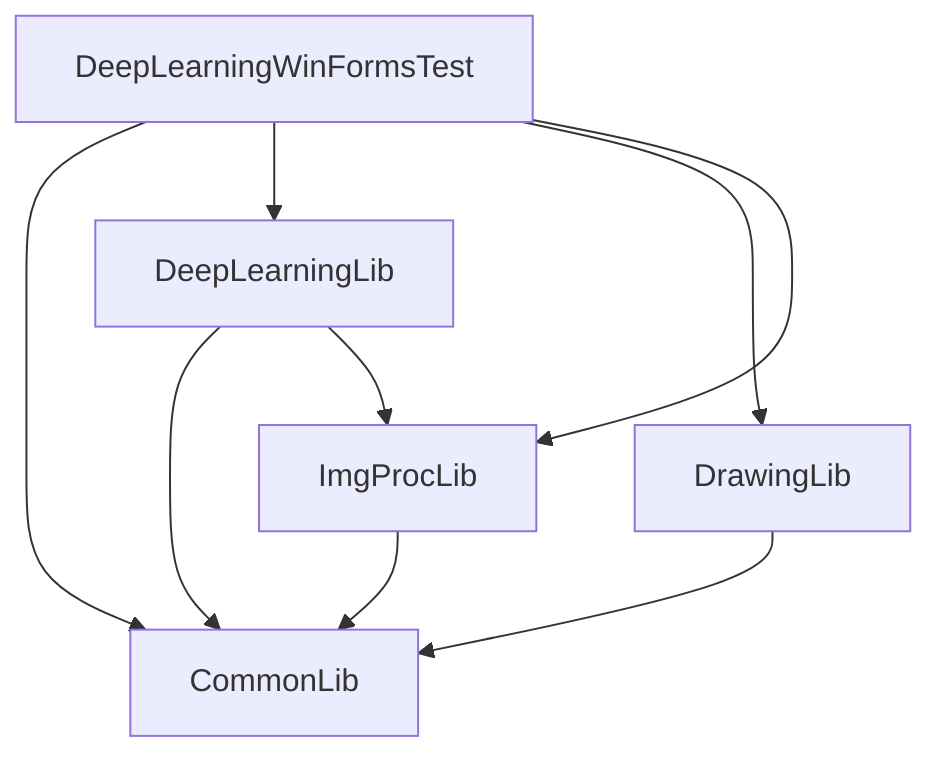
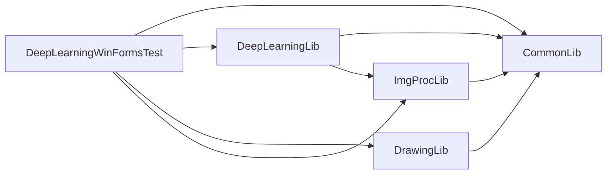

# CSProj Dependency Graph Generator

## Description

This Python script generates Mermaid markdown to visualize the dependencies between `.csproj` files within a directory and its subdirectories. The generated graph represents the relationships in a clear, visual format, either in top-down (TD) or left-right (LR) orientation.

Much of the code, comments, and readme file, were generated with help from
ChatGPT4 and github co-pilot 😀


## Features

- Generates Mermaid markdown representing the dependency graph of `.csproj` files.
- Supports recursive search in directories to find all `.csproj` files.
- Allows specifying the orientation of the generated graph.

## Requirements

- Python 3.6 or later

## Installation

Clone the repository or download the source code to your local machine. No additional Python packages are required, as the script uses the standard library modules `os`, `xml.etree.ElementTree`, and `enum`.

```bash
git clone https://github.com/nooogle/CSProjDependenciesToMermaid.git
cd csproj-dependency-graph-generator
```

## Usage

To generate a Mermaid markdown file for your project dependencies, run the script from the command line, specifying the directory to analyze and the desired orientation of the graph.

### Command Line Arguments

- `directory`: The path to the directory containing `.csproj` files. This path can be relative or absolute.
- `orientation` (optional): Specifies the orientation of the graph. Use `TD` for top-down or `LR` for left-right. Defaults to `TD` if not specified.

### Example use

```bash
python csproj_dependencies_to_mermaid.py "/path/to/your/directory" TD
```

This command analyzes all `.csproj` files within the specified directory and its subdirectories, then generates the Mermaid markdown in top-down orientation.

## Output

The script prints the generated Mermaid markdown to the standard output. You can redirect this output to a file:

```bash
python csproj_dependencies_to_mermaid.py "/path/to/your/directory" TD > dependency-graph.md
```

Then, you can use any Mermaid-compatible viewer or tool to visualize the graph. For example,
https://mermaid.live/ has a great interface and allows saving generated diagrams to PNG and 
other types of image file. 

## Contributing

Contributions to this project are welcome. Please follow the standard fork and pull request workflow.

## License

This project is licensed under the MIT License - see the LICENSE file for details.


## Examples

### Top-down



### Left-right

